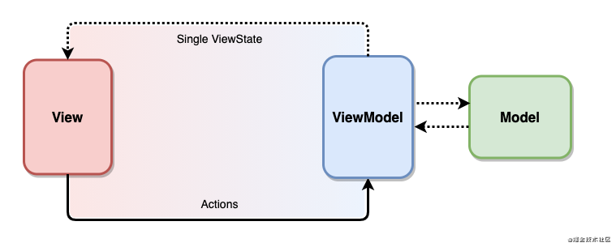

## SimpleCompose

A simple project in Jetpack Compose with MVVM + DI(Hilt) + Repository pattern + Retrofit

## Architecture
 

## Project
* `ApiService.kt` - Web Server where retrieve the JSON data.
* `DummyObject.kt` - Data model with the information to show in the table.
* `DummyObjectRepository.kt` - Interface for repository pattern.
* `DummyObjectRepositoryImpl.kt` - Implementation of the repository pattern
* `PersistenceModule.kt`, `NetworkiModule.kt`, `RepositoryModule.kt` - Hilt classes
* `MainActivity.kt` - Main activity of the project
* `MainViewModel.kt` - ViewModel of the MainActivity, prepare and manage the data for a UI component
* `DummyObjectDao.kt` - An interface for interacting with the data in your app's database
* `DummyObjectDatabase.kt` - Database implementation
* `Dialogs.kt` - Include composable for Progress dialog
* `HomeScreen.kt` - Include composables for create the list

## Developed By

Antonio Corrales desarrollogit@gmail.com

## License

Copyright 2022 Antonio Corrales

    Licensed under the Apache License, Version 2.0 (the "License");
    you may not use this file except in compliance with the License.
    You may obtain a copy of the License at

       http://www.apache.org/licenses/LICENSE-2.0

    Unless required by applicable law or agreed to in writing, software
    distributed under the License is distributed on an "AS IS" BASIS,
    WITHOUT WARRANTIES OR CONDITIONS OF ANY KIND, either express or implied.
    See the License for the specific language governing permissions and
    limitations under the License.

