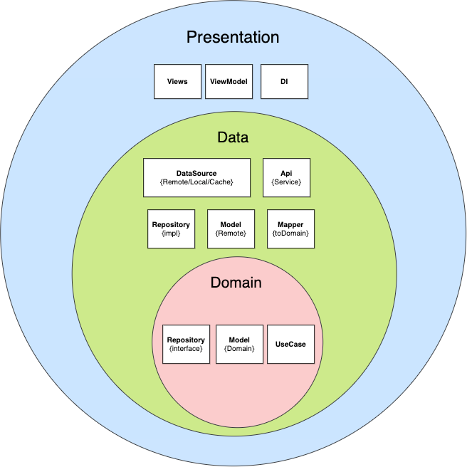

## SimpleCompose

A sample project with Clean Architecture in Jetpack Compose with MVVM + DI(Hilt) + Repository pattern + Retrofit + Usecases + Modularization

## Architecture
 

## Project
* `ApiService.kt` - Web Server where retrieve the JSON data.
* `DummyObject.kt` - Domain model with the information to show in the table.
* `DummyObjectRepository.kt` - Interface for repository pattern.
* `DummyObjectRepositoryImpl.kt` - Implementation of the repository pattern
* `PersistenceModule.kt`, `NetworkiModule.kt`, `RepositoryModule.kt` - Hilt classes
* `MainActivity.kt` - Main activity of the project
* `Dialogs.kt` - Include composable for progress dialog
* `HomeScreen.kt` - Include composables for create the list
* `MainViewModel.kt` - ViewModel of the MainActivity, prepare and manage the data for a UI component
* `DummyObjectDao.kt` - An interface for interacting with the data in your app's database
* `DummyObjectDatabase.kt` - Database implementation
* `DummyObjectEntity.kt` - Databse model with the information to store in database.
* `SuspendUseCase.kt`, `UseCase.kt`- Helper classes for create UseCases
* `GetDummyObjectsUseCase.kt`- Use case created in Domain layer
* `DummyObjectDTO.kt`- Data Transfer Object model from remote
* `NetworkBoundResource.kt` - A generic class that can provide a resource backed by both the sqlite database and the network

## Module domain
├── domain
    ├── model
    ├── repository
    ├── usecase

# Module data
├── data
    ├── error
    ├── local
        ├── dao
        ├── database
        ├── dto
        ├── entity
    ├── mapper
    ├── remote
    ├── repository

# Layers

Presentation Layer contains UI that are coordinated by Presenters/ViewModels which execute 1 or multiple Use cases. Presentation Layer depends on Domain Layer.

Domain Layer is the most INNER part of the onion (no dependencies with other layers) and it contains Entities, Use cases & Repository Interfaces. Use cases combine data from 1 or multiple Repository Interfaces.

Data Layer contains Repository Implementations and 1 or multiple Data Sources. Repositories are responsible to coordinate data from the different Data Sources. Data Layer depends on Domain Layer.

## Developed By

Antonio Corrales desarrollogit@gmail.com

## License

Copyright 2022 Antonio Corrales

    Licensed under the Apache License, Version 2.0 (the "License");
    you may not use this file except in compliance with the License.
    You may obtain a copy of the License at

       http://www.apache.org/licenses/LICENSE-2.0

    Unless required by applicable law or agreed to in writing, software
    distributed under the License is distributed on an "AS IS" BASIS,
    WITHOUT WARRANTIES OR CONDITIONS OF ANY KIND, either express or implied.
    See the License for the specific language governing permissions and
    limitations under the License.

